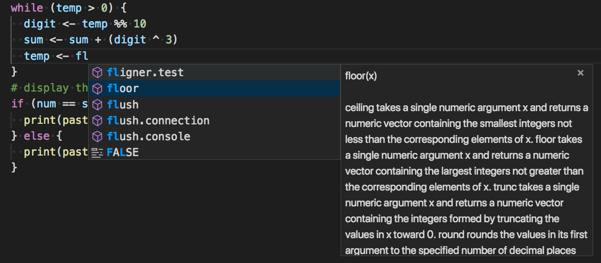

# R extension for Visual Studio Code

A [Visual Studio Code](https://code.visualstudio.com/) [extension](https://marketplace.visualstudio.com/VSCode) provides support for the [R language](https://www.r-project.org/) for R 3.2+. Features include syntax checking, completions, code formatting, formatting as you type, tooltips, linting.

## Prerequsites

- [.NET Core 2.1 Runtime](https://www.microsoft.com/net/download)
- [R distribution (64-bit only)](https://cloud.r-project.org/)

## Quick start

Open the Command Palette (Command+Shift+P on macOS and Ctrl+Shift+P on Windows/Linux) and type 'R:' to see list of available commands and shortcuts.

### _Syntax check_
Syntax check is performed as you type or when opening a file. Look for red squiggles. Problems are also reported in the `Problems` tab.

### _Formatting_
Extension provides ability to format document or selection. Formatting options are available in the `r.editor` settings section.

### _Automatic formatting (as you type)_
By default editor formats code after you type Enter, ; or }. You can deactivate the feature via `editor.formatOnType` setting. Formatting settings are the same as in the document formatting.

### _Linting_ 
Functionality is close to [lintr](https://github.com/jimhester/lintr). However, you do not have to run linting explicitly, it happens as you type. By default it is disabled, you can enable it by setting `r.linting.enabled` to `true`. Linter has various options available in the `r.linting` section.

### _Execute in terminal/source file_
Use `R: Execute line or selection` commands to execute line or selection in the terminal. Similarly, use `R: source file` to source file from the editor into the terminal section.

## Known issues
R session in the editor does not automatically pick up new packages installed in the terminal. You may have to reload the window for the session to pick up newly installed modules.

## Not currently supported
- Debugging
- Remote or Docker connectivity
- Completions in console
- In-app Plot or other graphical output
- 32-bit R
- Dynamic update of the session when new packages are installed.

## Bug reports
Please file issues at the project [GitHub](https://github.com/MikhailArkhipov/vscode-r)

## Disclaimer
- Extension is based on Microsoft R Tools for Visual Studio aka RTVS.
Please visit https://github.com/microsoft/rtvs for more information.
Prototype extension to VS Code can be found in the RTVS repo. 

- This project is a personal effort and although it builds upon RTVS,
it is not supported by Microsoft. I work on the code occasionally 
in my spare time.
